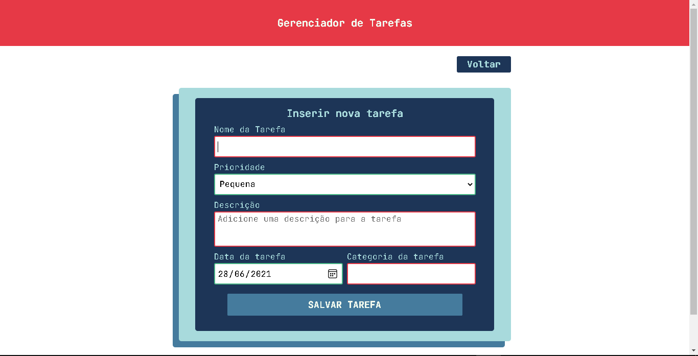

# task-manager-mvc

### This project shows some things I've been learning, as Repository pattern and unit tests.

# Table of contents
- [Screenshots](#screenshots)
- [Technologies](#technologies)

# Screenshots

- ### Home page without content

- ### Home page with content

- ### Create task page

- ### Edit task page

- ### Modal delete page

- ### Delete task page

# Technologies
### Technologies used in this project

- [ASP.NET Core](https://docs.microsoft.com/en-us/aspnet/core)
- [Dapper](https://dapper-tutorial.net/)
- [Sql Server](https://docs.microsoft.com/en-us/sql/sql-server)
- [Gulp](https://gulpjs.com/)
- [JavaScript](https://developer.mozilla.org/en-US/docs/Web/JavaScript/Guide/Introduction)
- [CSS](https://developer.mozilla.org/en-US/docs/Web/CSS)
- [EditorConfig](https://editorconfig.org/)
- [xUnit](https://xunit.net/)
- [Moq](https://github.com/moq/moq4)